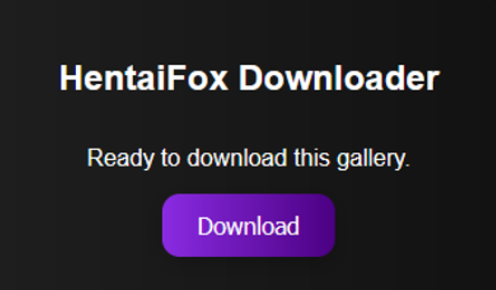

# HentaiFox Downloader Extension

This browser extension allows you to easily download galleries from HentaiFox, either as individual images or as a single zip file. It is available for both Chrome and Firefox.

## Features

-   **Cross-Browser Support**: Works on both Chrome (Manifest V3) and Firefox (Manifest V2).
-   **Multiple Download Options**: Download galleries as individual images or as a single zip file.
-   **Sleek UI**: A modern, dark-themed user interface with a custom scrollbar for a better user experience.
-   **Single and Multiple Gallery Downloads**: Download a single gallery from its page or select multiple galleries to download from the homepage.

## Screenshots

### Gallery Popup

## Installation

### Chrome

1.  Download the latest release from the [releases page](https://github.com/Yui007/hentaifox_extension/releases) or clone the repository.
2.  Open Chrome and navigate to `chrome://extensions`.
3.  Enable **Developer mode** in the top right corner.
4.  Click **Load unpacked** and select the `chrome` directory from the cloned repository.
5.  The extension should now be installed and ready to use.

### Firefox

1.  Download the latest release from the [releases page](https://github.com/Yui007/hentaifox_extension/releases) or clone the repository.
2.  Open Firefox and navigate to `about:debugging#/runtime/this-firefox`.
3.  Click **Load Temporary Add-on...**.
4.  Navigate to the `Firefox` directory from the cloned repository and select the `manifest.json` file.
5.  The extension should now be installed for the current session.

## How to Use

1.  Navigate to [HentaiFox](https://hentaifox.com/).
2.  Click on the extension icon in your browser's toolbar.
3.  **On the homepage**: A list of galleries on the current page will be displayed. Select the galleries you want to download and click **Download Selected**. You will then be prompted to choose between downloading as individual images or as a zip file.
4.  **On a gallery page**: The extension will detect that you are on a gallery page and will present you with a "Download" button. Click it to choose between downloading as individual images or as a zip file.

## Development

This project is structured to support both Chrome and Firefox with their different manifest versions.

-   `chrome/`: Contains the Chrome extension files (Manifest V3).
-   `Firefox/`: Contains the Firefox extension files (Manifest V2).

To contribute, simply clone the repository, make your changes in the respective directories, and submit a pull request.

## Contributing

Pull requests are welcome. For major changes, please open an issue first to discuss what you would like to change.

## License

This project is licensed under the MIT License.